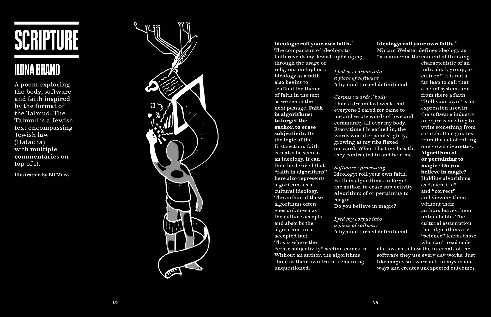
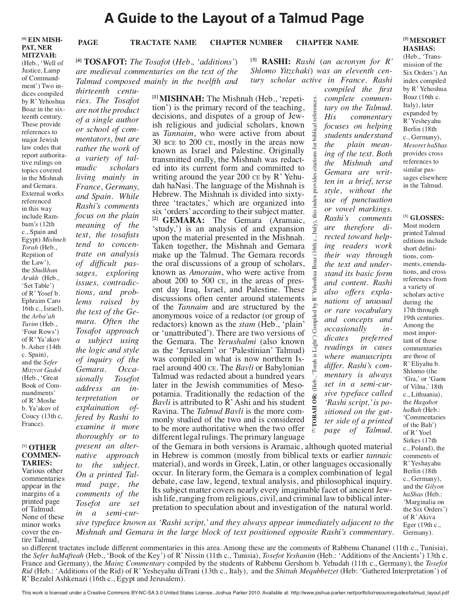

# Scripture: A Poem
I wrote Scripture based on the format of the Talmud. I used the format of the Jewish Talmud to interrogate the often-forgotten subjectivity of writing algorithms, positioning algorithms as a modern "scripture" of the people

Scripture was published in the critical theory of technology class zine collectively made by the Fall 2018 [School for Poetic Computation](http://sfpc.io) class.

The poem reflects the Talmudic framework as each piece of critique in the side panels of the text is formatted to reflect how old Rabbi's discussed the central passages:

